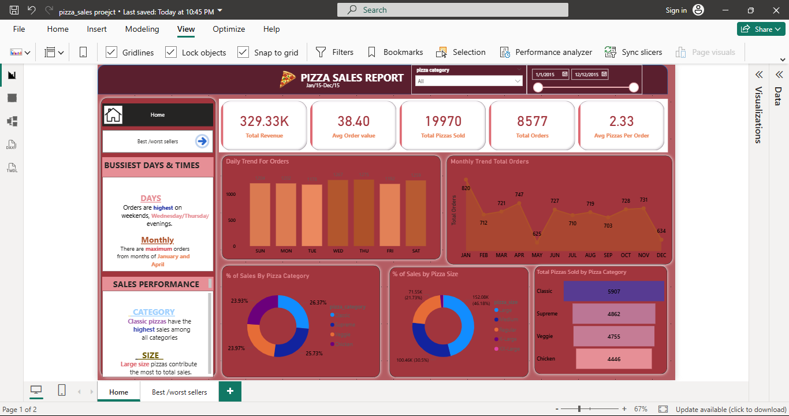
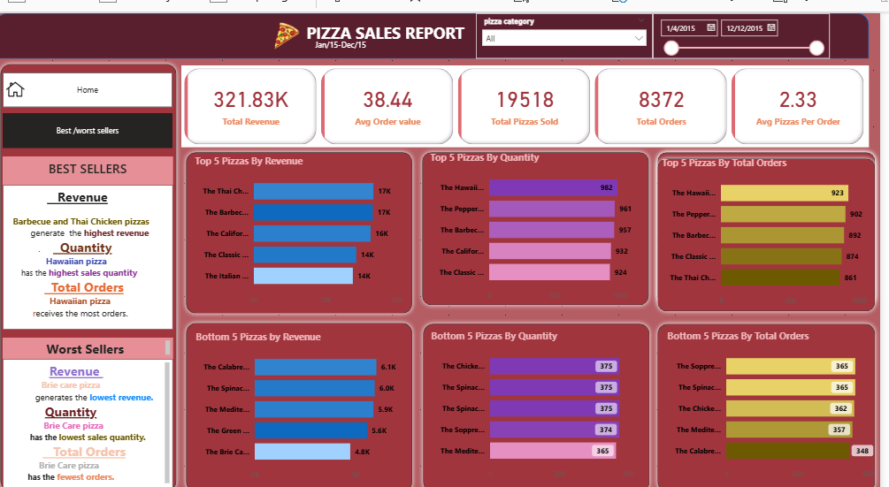

# 🍕 Pizza Sales Analysis (SQL + Power BI)

## 📌 Project Overview
This project performs an end-to-end analysis of pizza sales data using SQL and Power BI to uncover insights into revenue, order trends, customer preferences, and product performance.

## 🛠 Tools & Technologies
- SQL (data validation & aggregation)
- Power BI (Power Query, DAX, interactive dashboards)
- CSV dataset

## 📊 Key KPIs
- Total Revenue
- Total Orders
- Total Pizzas Sold
- Average Order Value
- Average Pizzas per Order

## 🔍 Analysis Performed
- Daily and monthly order trends
- Sales distribution by pizza category and size
- Best and worst selling pizzas by revenue, quantity, and orders
- Peak business days and times analysis

## 🧹 Data Cleaning & Feature Engineering
- Cleaned raw data using Power Query
- Added derived columns (Day, Month, Hour)
- Validated revenue using quantity × unit price

## 📈 Dashboard Preview

## 📎 Notes
SQL was used for data validation and aggregation, while Power BI was used for data cleaning, feature engineering, and visualization.
